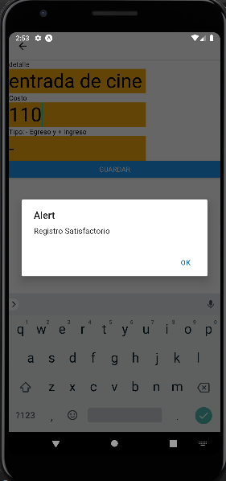
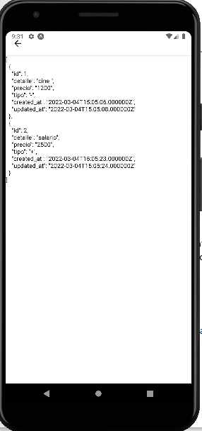

# Consumo de datos con API. REST de Laravel y vue-router
Esta aplicación tiene dos objetivos, uno, mostrar como ser realiza un menu sencillo, y otra la funcionalidad de consumo de datos API REST de laravel.




# INTALACIÓN Y USO
## PASO 1. Instalar laragon
***
Para este proyecto, se recomienda tener instalado [Laragon - Full (147 MB)](https://laragon.org/download/) 
## PASO 2. Carpeta de trabajo
***
Tener una carpeta de trabajo, por ejemplo en windows:
```bash
cd C:\tecnoprofe
```
## PASO 3 Clonar proyecto
***
Descargar el proyecto, con el siguiente comando.
```bash
git clone https://gitlab.com/tecnoprofe/axios-vue-native.git
cd C:\tecnoprofe\axios-vue-native
```
***
Instalación
```bash
npm install
```
## PASO 4. Ejecución de la aplicación
```bash
npm start
```
***
Es recomendable contar con expo-cli instalado de manera global, para usar el siguiente comando, que produce el mismo resultado. 
```bash
expo start
```
# SIGUEME EN MIS REDES SOCIALES
- [Visita mi canal de youtube ](https://www.youtube.com/tecnoprofe)
- [Sigueme en Facebook](https://www.facebook.com/zambranachaconjaime/)

